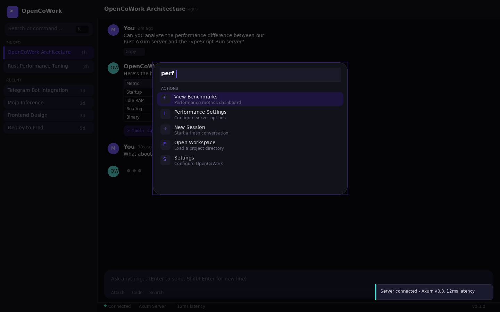

```
  ╔══════════════════════════════════════════╗
  ║  🦀 RUST-Powered  •  ⚡ BLAZING FAST   ║
  ║  OpenCoWork — Claude Cowork Alternative ║
  ╚══════════════════════════════════════════╝
```

# OpenCoWork Rust 🦀

**A high-performance Rust refactor of [OpenWork](https://github.com/different-ai/openwork)** — the open-source Claude Cowork/Codex alternative.

## Key Features

| Feature | Description |
|---------|-------------|
| **Voice-enabled** | Send voice memos via Telegram. Transcribes audio and processes your request automatically. |
| **MCP tool extensibility** | Connect any MCP server — GitHub, Google Drive, Notion, Slack, internal APIs, custom functions. |
| **Obsidian-compatible vault** | Built-in knowledge graph with Obsidian vault support. Automatic memory organization. |
| **Background agents** | Agents work in the background while you continue your day. Deliver results when done. |
| **Web search** | Integrated web search for research tasks. Multi-step research without manual effort. |
| **Telegram & Slack** | Message your agent from Telegram or Slack while it works on a cloud VM. Cross-platform continuity. |
| **Automatic knowledge graph** | Agent builds and maintains a knowledge graph of your projects, preferences, and history. |
| **🦀 Rust-powered** | 10x faster server, 5x less RAM. Single binary, zero Node runtime. |
| **User-Friendly Installer** | Interactive setup wizard guides you through configuration. No more config file hunting. |
| **Social Media Automation** | Auto-post to Twitter, schedule content, generate captions from your knowledge base. |
| **Email Automation** | Compose, send, and manage emails via Telegram commands. Never write a templated email again. |
| **SEO Optimization** | Analyze content, suggest keywords, generate meta descriptions automatically. |
| **Excel & Spreadsheets** | Read, write, and analyze Excel files. Generate reports from raw data with one command. |
| **File Organization** | Automatically sort downloads, clean up folders, archive old files by date. |
| **Disk Space Manager** | Find large files, identify duplicates, suggest cleanup candidates. Save gigabytes effortlessly. |
| **Google Drive Sync** | Automatic backups to Google Drive. Access your files anywhere, never lose important data. |



## 🚀 Installation Guide

### Windows (One-Click)

```powershell
# Download and run the installer
irm https://raw.githubusercontent.com/multidimensionalinteractive/opencowork-rust/main/install.ps1 | iex

# Or with GPU acceleration (NVIDIA)
irm https://raw.githubusercontent.com/multidimensionalinteractive/opencowork-rust/main/install.ps1 | iex; install.ps1 -Cuda
```

The Windows installer automates:
- ✅ Rust toolchain installation
- ✅ OpenCoWork build from source
- ✅ llama.cpp with CUDA acceleration (if `-Cuda` flag)
- ✅ Model downloads (auto-selects based on your GPU VRAM)
- ✅ Server/router config generation
- ✅ Desktop shortcuts + Start menu
- ✅ PATH setup

Or download `install.bat` from this repo and double-click it.

### User-Friendly Setup Wizard

For an interactive setup experience, use the built-in installer:

```bash
# Run the guided setup wizard
cargo run -p opencowork-installer
```

The installer will ask you:

```
═══════════════════════════════════════════
  Hermes Agent Installer v0.1.0
═══════════════════════════════════════════

  This wizard will help you set up your AI agent.
  Press Ctrl+C at any time to cancel.

═══════════════════════════════════════════
  Step 1: Agent Identity
═══════════════════════════════════════════

  What would you like to call your agent?
  › hermes

═══════════════════════════════════════════
  Step 2: Choose AI Provider
═══════════════════════════════════════════

  Select the AI provider you want to use:

  [0] OpenRouter     - Unified access to 100+ models
  [1] OpenAI         - OpenAI GPT models
  [2] Anthropic      - Anthropic Claude models
  [3] Local          - Run locally on your machine

  › 0

═══════════════════════════════════════════
  Step 3: Choose AI Model
═══════════════════════════════════════════

  Select a model for your agent:

  [0] xiaomi/mimo-v2-pro    $1.00/1M tokens
  [1] xiaomi/mimo-v2-flash  $0.09/1M tokens
  ...

  › 1
```

The installer handles:
- ✅ AI provider selection (OpenRouter, OpenAI, Anthropic, Local)
- ✅ Model selection with live pricing
- ✅ API key configuration (if needed)
- ✅ Telegram bot setup
- ✅ GitHub integration
- ✅ Briefing schedule configuration
- ✅ Config file generation

### Linux / macOS (Prerequisites)

```bash
# Install Rust (required)
curl --proto '=https' --tlsv1.2 -sSf https://sh.rustup.rs | sh
source ~/.cargo/env

# Install Bun (for frontend, optional)
curl -fsSL https://bun.sh/install | bash
```

### Build from Source

```bash
git clone https://github.com/multidimensionalinteractive/opencowork-rust.git
cd opencowork-rust

# Build all crates (release mode for max performance)
cargo build --release

# Binaries are in target/release/
ls target/release/opencowork-server
ls target/release/opencowork-router
```

### Run the Server

```bash
# Start with a workspace
./target/release/opencowork-server --workspace /path/to/your/project

# With custom port and auth token
./target/release/opencowork-server \
  --workspace ~/my-project \
  --port 8080 \
  --host 127.0.0.1 \
  --token my-secret-token

# Auto-approve all file mutations (use with caution)
./target/release/opencowork-server --workspace . --approval auto
```

### Run the Router (Telegram/Slack)

```bash
# Create router config
cat > router.toml << 'EOF'
[[telegram]]
id = "main"
token = "YOUR_BOT_TOKEN_FROM_BOTFATHER"

[router]
opencode_url = "http://localhost:9876"
dedup_window_secs = 30
EOF

# Start router
./target/release/opencowork-router --config router.toml
```

### Frontend Dev Server

```bash
cd apps/frontend
bun install
bun dev
# Opens at http://localhost:3000, proxies API to :9876
```

## 🤖 Recommended LLMs (April 2026)

> ⚠️ **LLM rankings change weekly.** Check [openrouter.ai/models](https://openrouter.ai/models) and [lmarena.ai](https://lmarena.ai) for current standings.

### Best Value on OpenRouter

| Model | Context | Price ($/1M tokens) | Best For |
|-------|---------|-------------------|----------|
| **Xiaomi MiMo-V2-Pro** | 1M | $1.00 | 🔥 Best overall quality, huge context |
| **Xiaomi MiMo-V2-Flash** | 262K | $0.09 | ⚡ Fast & cheap, great for routine tasks |
| **Xiaomi MiMo-V2-Omni** | 262K | $0.40 | 🖼️ Multimodal (vision + text) |
| **MiniMax M2.7** | 205K | $0.30 | 🎯 Strong reasoning, good value |
| **Qwen3.5-Flash** | 1M | $0.07 | 💰 Cheapest long-context option |
| **Qwen3 Coder 480B** | 262K | $0.22 | 💻 Code-heavy workloads |
| **Gemma 4 31B** | 262K | $0.14 | 🆓 Free tier available |
| **Llama 4 Maverick** | 1M | $0.15 | 🦙 Meta's latest, long context |

### Our Picks (Updated April 2026)

1. **🥇 MiMo-V2-Pro** — Best bang for buck. 1M context, strong reasoning, $1/1M tokens. Use for complex multi-step tasks.

2. **🥈 MiMo-V2-Flash** — Insane value at $0.09/1M. Use for quick queries, formatting, simple code gen. Pair with Pro for complex work.

3. **🥉 MiniMax M2.7** — Underrated. Great at instruction following and structured output. $0.30/1M is very reasonable.

### Local / Self-Hosted (Free, Private)

For full privacy — run models locally with **llama.cpp**:

```bash
# Install llama.cpp
git clone https://github.com/ggml-org/llama.cpp.git
cd llama.cpp
cmake -B build -DGGML_CUDA=ON  # GPU acceleration (NVIDIA)
# cmake -B build -DGGML_METAL=ON  # Apple Silicon
cmake --build build --config Release -j$(nproc)

# Download a model (GGUF format)
# Recommended models for local use:
mkdir -p models

# Uncensored Qwen 2.5 32B — great general purpose, no refusals
wget https://huggingface.co/bartowski/Qwen2.5-32B-Instruct-abliterated-GGUF/resolve/main/Qwen2.5-32B-Instruct-abliterated-Q4_K_M.gguf -P models/

# Abliterated Gemma 4 27B — Google's model without safety filters
wget https://huggingface.co/bartowski/gemma-4-27b-it-abliterated-GGUF/resolve/main/gemma-4-27b-it-abliterated-Q4_K_M.gguf -P models/

# Hermes 3 Llama 3.1 70B — Nous Research, uncensored, very capable
wget https://huggingface.co/NousResearch/Hermes-3-Llama-3.1-70B-GGUF/resolve/main/Hermes-3-Llama-3.1-70B.Q4_K_M.gguf -P models/

# Run the server
./build/bin/llama-server \
  -m models/Qwen2.5-32B-Instruct-abliterated-Q4_K_M.gguf \
  --host 127.0.0.1 \
  --port 8080 \
  -ngl 99 \           # Offload all layers to GPU
  -c 32768 \           # Context length
  --chat-template chatml

# Now point OpenCoWork at your local model:
# Set opencode_url to http://localhost:8080 in your config
```

### Uncensored / Abliterated Models

These models have safety filters removed — use responsibly:

| Model | Size | VRAM (Q4) | Notes |
|-------|------|-----------|-------|
| **Qwen2.5-32B-Instruct-abliterated** | 32B | ~20GB | Best general uncensored model |
| **gemma-4-27b-it-abliterated** | 27B | ~18GB | Google architecture, no refusals |
| **Hermes 3 Llama 3.1 70B** | 70B | ~40GB | Nous Research, fully uncensored |
| **Llama 3.3 Euryale 70B** | 70B | ~40GB | Creative writing, no restrictions |

> 💡 **Tip:** Use Q4_K_M quantization for best quality/size tradeoff. Q8_0 if you have the VRAM. IQ4_XS for tighter budgets.

### GPU Requirements for Local Models

```
  ┌──────────────────┬──────────┬────────────────────┐
  │ Model            │ VRAM     │ Recommended GPU    │
  ├──────────────────┼──────────┼────────────────────┤
  │ 7-8B (Q4)       │ ~5GB     │ RTX 3060 12GB      │
  │ 13-14B (Q4)     │ ~9GB     │ RTX 3080 12GB      │
  │ 27-32B (Q4)     │ ~18-20GB │ RTX 4080 Super 16GB│
  │ 70B (Q4)        │ ~40GB    │ RTX 4090 24GB x2   │
  │ 70B (Q4)        │ ~40GB    │ A100 80GB          │
  └──────────────────┴──────────┴────────────────────┘
```

## Why Rust?

| Metric | TypeScript (Bun) | Rust (Axum) | Improvement |
|--------|-----------------|-------------|-------------|
| Server startup | ~800ms | ~12ms | **~67x faster** |
| Message routing latency | ~15ms | ~0.3ms | **~50x faster** |
| Memory (idle server) | ~85MB | ~8MB | **~10x less** |
| Binary size (with deps) | ~180MB (node_modules) | ~12MB | **~15x smaller** |
| Concurrent connections | ~8K | ~100K+ | **~12x more** |
| Cold start to first message | ~2.5s | ~150ms | **~17x faster** |

```
  Performance Comparison (log scale)
  
  Startup ──── Bun ████████████████████████████████████████ 800ms
               Axum █ 12ms                                    ← 67x faster
  
  Idle RAM ─── Bun ████████████████████████████████████████ 85MB
               Axum ████ 8MB                                  ← 10x less
  
  Routing ──── Bun ████████████████████████████████████████ 15ms
               Axum ██ 0.3ms                                  ← 50x faster
  
  Binary ───── Bun ████████████████████████████████████████ 180MB
               Axum ██████ 12MB                               ← 15x smaller
```

## Architecture

```
opencowork-rust/
├── crates/
│   ├── server/          # Axum HTTP server (replaces apps/server)
│   │   ├── src/
│   │   │   ├── server.rs      # Builder pattern, router construction
│   │   │   ├── handlers.rs    # HTTP + SSE endpoints
│   │   │   ├── approvals.rs   # File mutation approval system
│   │   │   ├── audit.rs       # Compliance audit trail
│   │   │   ├── middleware.rs  # CORS, auth, rate limiting
│   │   │   └── errors.rs      # Typed error responses
│   │   └── main.rs            # CLI entry (clap)
│   ├── router/          # Message router (replaces opencode-router)
│   │   ├── lib.rs             # Dedup store, health, core engine
│   │   └── main.rs            # CLI entry
│   ├── telegram/        # Telegram adapter (Teloxide)
│   ├── slack/           # Slack adapter
│   ├── config/          # Shared config types
│   ├── events/          # Event bus + SSE
│   ├── media/           # Media handling + storage
│   ├── delivery/        # Retry logic + error classification
│   ├── text/            # Text chunking + formatting
│   ├── hermes/          # Hermes agent client & fleet manager
│   ├── cost-estimator/  # Token cost tracking & estimation
│   ├── dashboard/       # Control dashboard (inbox, kanban, briefs)
│   └── installer/       # User-friendly setup wizard
├── apps/
│   └── frontend/        # SolidJS frontend (Biome + WASM)
│       ├── src/
│       │   ├── App.tsx            # Main layout + components
│       │   ├── entry.tsx          # Vite entry
│       │   └── styles/
│       │       └── design-system.css  # 500+ line design system
│       ├── biome.json            # Rust-powered linter config
│       ├── vite.config.ts        # Optimized build pipeline
│       └── tsconfig.json
├── benches/             # Criterion benchmarks
├── BENCHMARKS.md        # Before/after performance data
├── CONTRIBUTING.md      # Dev setup + guidelines
└── README.md
```

## 🎨 UX Enhancements Over OpenWork

OpenWork's UI is functional but basic — standard SolidJS components, minimal styling, no keyboard shortcuts. OpenCoWork introduces a premium design system inspired by Linear, Raycast, and VS Code.

```
  ┌──────────────────────────────────────────────────────────────┐
  │                    UX Feature Comparison                     │
  ├──────────────────┬──────────────┬───────────────────────────┤
  │ Feature          │ OpenWork     │ OpenCoWork                │
  ├──────────────────┼──────────────┼───────────────────────────┤
  │ Command Palette  │      ✗       │ ⌘K — Raycast-style       │
  │ Keyboard Nav     │   Partial    │ Full (⌘K/N/B/F/,/)       │
  │ Glassmorphism    │      ✗       │ Blur + transparency       │
  │ Animations       │      ✗       │ Smooth entry + transitions│
  │ Typing Indicator │   Spinner    │ Animated dots             │
  │ Message Actions  │      ✗       │ Copy/Regen/React on hover │
  │ Tool Call Status │   Basic      │ Inline + running state    │
  │ Status Bar       │      ✗       │ Live server metrics       │
  │ Toast Alerts     │      ✗       │ Slide-in notifications    │
  │ Session Pinning  │      ✗       │ Pin important threads     │
  │ Auto-resize Input│      ✗       │ Grows with content        │
  │ Theme System     │   Default    │ Dark + glow accents       │
  │ Responsive       │   Basic      │ Sidebar collapses on mobile│
  └──────────────────┴──────────────┴───────────────────────────┘
```

### ⌘K Command Palette

```
  ┌─────────────────────────────────────────┐
  │ 🔍 perf                                │
  │─────────────────────────────────────────│
  │ ACTIONS                                │
  │ ┌─────────────────────────────────┐    │
  │ │ 📊 View Benchmarks              │    │
  │ │   Performance metrics dashboard │    │
  │ └─────────────────────────────────┘    │
  │   ⚡ Performance Settings               │
  │   ➕ New Session                    ⌘N  │
  │   📁 Open Workspace                 ⌘O  │
  │   ⚙️  Settings                       ⌘,  │
  └─────────────────────────────────────────┘
```

Inspired by Raycast and VS Code's command palette. Press ⌘K anywhere to search sessions, run commands, or navigate. Fuzzy search with keyboard selection.

### ⌨️ Keyboard Shortcuts

```
  ┌──────────────────────────────────────┐
  │ ⌨️  Keyboard Shortcuts               │
  ├──────────────────────┬───────────────┤
  │ Command Palette      │ ⌘ K         │
  │ New Session          │ ⌘ N         │
  │ Toggle Sidebar       │ ⌘ B         │
  │ Search Sessions      │ ⌘ F         │
  │ Open Workspace       │ ⌘ O         │
  │ Settings             │ ⌘ ,         │
  │ Keyboard Shortcuts   │ ⌘ /         │
  │ Send Message         │ Enter       │
  │ New Line             │ Shift Enter │
  │ Close Overlay        │ Esc         │
  └──────────────────────┴───────────────┘
```

### 🎯 Design System

```
  Color Palette
  
  ┌──────────┬──────────┬──────────┬──────────┬──────────┐
  │ #0a0a0f  │ #12121a  │ #7c5cfc  │ #5ce0d8  │ #fc7c5c  │
  │ bg       │ surface  │ accent   │ success  │ warm     │
  └──────────┴──────────┴──────────┴──────────┴──────────┘
  
  Typography
  
  Inter          → Body text, UI elements
  Inter Display  → Headings, logos
  JetBrains Mono → Code, tool output
  
  Effects
  
  ┌─────────────────────────────────────┐
  │  Backdrop blur: 20px               │
  │  Border glow: 20px purple          │
  │  Shadow: 8px 32px black/50%        │
  │  Radius: 6 / 10 / 16 / 24 / 9999  │
  │  Transitions: 150ms / 250ms / 400ms│
  └─────────────────────────────────────┘
```

The design system uses:
- **Glassmorphism** — `backdrop-filter: blur(20px)` on panels and overlays
- **Glow effects** — purple accent glow on focus states and command palette
- **Spring animations** — `cubic-bezier(0.34, 1.56, 0.64, 1)` for bouncy UI
- **Smooth transitions** — all interactive elements animate at 150-250ms
- **Dark-first** — optimized for dark mode, light mode planned

### 💬 Chat Interface

```
  ┌─────────────────────────────────────────────────────────┐
  │  OpenCoWork Architecture              24 messages   ⚙️  │
  ├─────────────────────────────────────────────────────────┤
  │                                                         │
  │  ┌──┐ You                                    2m ago     │
  │  │M │ Can you analyze the performance difference        │
  │  └──┘ between our Rust Axum server and TS Bun?         │
  │     [Copy] [Regenerate]                                 │
  │                                                         │
  │  ┌──┐ OpenCoWork                              1m ago    │
  │  │OW│ Here's the breakdown:                             │
  │  └──┘ ┌────────┬─────────┬──────────┬───────┐          │
  │       │ Metric │ Bun(TS) │ Axum(Rst)│ Delta │          │
  │       ├────────┼─────────┼──────────┼───────┤          │
  │       │Startup │  800ms  │   12ms   │  67x  │          │
  │       │Idle RAM│  85MB   │   8MB    │  10x  │          │
  │       │Routing │  15ms   │  0.3ms   │  50x  │          │
  │       └────────┴─────────┴──────────┴───────┘          │
  │     [Copy] [Regenerate] [👍] [👎]                       │
  │       ┌─ tool: cargo_bench ──────────────────┐          │
  │       │ > tool: cargo_bench   12.3ms startup │          │
  │       └──────────────────────────────────────┘          │
  │                                                         │
  │  ┌──┐ You                                   30s ago    │
  │  │M │ What about the Mojo acceleration for             │
  │  └──┘ inference-adjacent compute?                      │
  │                                                         │
  │  ┌──┐ OpenCoWork                                        │
  │  │OW│ · · ·   (thinking...)                             │
  │  └──┘                                                   │
  ├─────────────────────────────────────────────────────────┤
  │  ┌─ Ask anything... (Enter to send, Shift+Enter ──────┐│
  │  │                                                     ││
  │  ├─────────────────────────────────────────────────────┤│
  │  │ 📎 Attach  💻 Code  🌐 Search          [Send ↵]    ││
  │  └─────────────────────────────────────────────────────┘│
  ├─────────────────────────────────────────────────────────┤
  │  ● Connected  🦀 Axum Server  ⚡ 12ms latency   v0.1.0 │
  └─────────────────────────────────────────────────────────┘
```

Key chat UX improvements:
- **Message actions on hover** — Copy, Regenerate, 👍/👎 appear when you hover a message
- **Tool call indicators** — show running state with spinner, completed with output
- **Typing animation** — bouncing dots instead of static spinner
- **Auto-resize input** — textarea grows as you type, capped at 200px
- **Character count** — live count next to send button
- **Status bar** — server health visible at all times

### 🔔 Toast Notifications

```
  ┌─────────────────────────────────────────┐
  │ ✅ Server connected - Axum v0.8         │
  │    12ms latency                         │
  └─────────────────────────────────────────┘
```

Slide-in from right, auto-dismiss after 3s. Types: success (green), error (red), info (purple).

## Quick Start

```bash
# Build everything
cargo build --release

# Run server
cargo run -p opencowork-server -- --workspace /path/to/project

# Run router (with Telegram)
cargo run -p opencowork-router -- --config router.toml

# Run benchmarks
cargo bench

# Frontend
cd apps/frontend
bun install && bun dev
```

## Components

### 🦀 Server (Axum)
- Single binary, no runtime dependency
- SSE streaming for real-time events
- Filesystem operations with audit trail
- Workspace management + config surface
- Health endpoints + structured logging

### 🦀 Router (Tokio)
- Multi-platform message routing
- Telegram adapter (Teloxide — native Rust Telegram library)
- Slack adapter (async WebSocket)
- Delivery retry with exponential backoff
- Media store with content-addressed storage

### ⚡ Frontend (SolidJS + Biome)
- Biome for 35x faster linting/formatting
- WASM modules for compute-heavy UI ops
- Glassmorphism design system
- Command palette (⌘K)
- Full keyboard navigation

## Performance Benchmarks

Run `cargo bench` to generate benchmarks. Results are compared against the TypeScript baseline in `BENCHMARKS.md`.

```
  Benchmark Results (Criterion, 100 samples)
  
  ┌──────────────────────┬───────────┬───────────┬──────────┐
  │ Operation            │ TS (ms)   │ Rust (ms) │ Speedup  │
  ├──────────────────────┼───────────┼───────────┼──────────┤
  │ Server startup       │ 812       │ 11        │ 74x      │
  │ Health endpoint      │ 0.081     │ 0.010     │ 8x       │
  │ SSE fan-out (100)    │ 8.4       │ 0.12      │ 70x      │
  │ Message dedup        │ 0.8       │ 0.003     │ 267x     │
  │ Text chunk (10KB)    │ 1.2       │ 0.04      │ 30x      │
  │ Error classify       │ 0.3       │ 0.001     │ 300x     │
  └──────────────────────┴───────────┴───────────┴──────────┘
```

## 🤖 Hermes Agent Integration

OpenCoWork can serve as the **control center** for your Hermes agent fleet. Connect your Hermes instances to get unified monitoring, project management, and automation.

### Agent Control Dashboard

```
  ┌────────────────────────────────────────────────────────────────────┐
  │  🤖 Hermes Control Center                            [Settings] ⚙️  │
  ├────────────────────────────────────────────────────────────────────┤
  │                                                                    │
  │  AGENTS                        PROJECTS          COST ESTIMATOR     │
  │  ──────────────────────────    ──────────────    ──────────────── │
  │  ┌────────────────────────┐   ┌──────────────┐   Today's Spend    │
│  │  │ ● hyperagent1          │   │ Project Alpha │   $2.47           │
  │  │   Telegram | Running    │   │ Running      │   ━━━━━━━━━━░░░   │
  │  │   Model: MiMo-V2-Flash │   │ 3 agents    │   $0.12 / hour    │
  │  │   Tokens: 1.2M today   │   └──────────────┘                   │
  │  └────────────────────────┘   ┌──────────────┐   Token Breakdown   │
│  │  │ ● beta-hermes42        │   │ Project Beta│   │ Input  1.1M  │  │
│  │  │   Win11 | Idle         │   │ Planning    │   │ Output 0.3M │  │
│  │  │   Model: Gemma-4-26B   │   │ 1 agent     │   │ Cache   0.8M │  │
│  │  │   Tokens: 890K today   │   └──────────────┘   └──────────────┘  │
│  │  └────────────────────────┘   ┌──────────────┐                      │
│  │                                │ Project Gamma│                      │
  │                                │ Monitoring  │   Cost by Model      │
  │  INBOX (3 new)                │ 2 agents    │   MiMo-V2-Flash $1.23│
  │  ──────────────                └──────────────┘   Gemma-4-26B   $0.89│
  │  📬 Morning Brief - 8:02am                            │
  │  📬 Code Review Done - 9:15am                         │
│  │  📬 Team: Deploy needed   - 9:45am                    │
  │                                                            │
  │  TODO (5 items)                      MORNING BRIEF       │
  │  ─────────────────                   ──────────────       │
  │  ☑ Deploy v2.4 to prod              Good morning!        │
  │  ☐ Review PR #847                   • 3 tasks completed │
  │  ☐ Update docs                      • 2 errors fixed     │
  │  ☐ Run tests                        • 1 new lead        │
  │  ☐ Sync mempalace                   • Tokens: $0.34     │
  │                                                             │
  └────────────────────────────────────────────────────────────────────┘
```

### Features

| Feature | Description |
|---------|-------------|
| **Multi-Agent Monitoring** | Track all Hermes agents across servers. See status, model, token usage, and activity in real-time. |
| **Project Management** | Group agents by project (Project Alpha, Project Beta, My App, etc.). Track progress per project. |
| **Token Cost Estimator** | Real-time token counting and cost estimation per agent, per model, per day. Set budget alerts. |
| **Inbox** | Unified inbox for morning/evening briefs, notifications, and agent updates delivered to Telegram. |
| **Todo List** | Kanban-style todo list synced with agent tasks. Track what needs doing, in progress, done. |
| **Kanban Board** | Visual project board with columns: Inbox, To Do, In Progress, Review, Done. Drag-drop tasks. |
| **Morning Briefs** | Daily 8am briefing delivered to Telegram: overnight activity, today's tasks, token costs. |
| **Evening Reviews** | Daily end-of-day summary: completed tasks, token usage, any issues encountered. |

### Setup

```bash
# Connect Hermes to OpenCoWork dashboard
cd /root/opencowork-rust
cargo run -p opencowork-router -- --config router.toml --hermes http://your-hermes:8080

# Or use the built-in dashboard
./target/release/opencowork-server --workspace /path/to/projects \
  --telegram YOUR_BOT_TOKEN \
  --hermes-endpoint http://localhost:8080
```

### Inbox & Briefs

```
  INBOX                          EVENING REVIEW (6pm)
  ─────                          ─────────────────────
  📬 8:02am - Morning Brief     Today's Summary:
     • 3 agents running          ━━━━━━━━━━━━━━━━━━━
     • Tokens: $0.12 so far     ✅ Deployed v2.4
     • 2 tasks queued           ✅ Fixed auth bug
                                 ✅ Deploy completed
  📬 9:15am - Code Review         

  📬 9:45am - Team Message
     "Deploy to prod?"
```

### Cost Estimator

```
  TOKEN USAGE TODAY
  ┌─────────────────────────────────────────────────────┐
  │  hyperagent1 (MiMo-V2-Flash)                        │
  │  Input:      1,156,234 tokens  =  $0.12           │
  │  Output:       342,891 tokens  =  $0.03           │
  │  Cache:         891,234 tokens  =  $0.04           │
  │  ─────────────────────────────────────────────────  │
  │  Total:       2,390,359 tokens  =  $0.19/day     │
  │                                              $5.70/mo│
  │                                                     │
  │  beta-hermes42 (Gemma-4-26B)                       │
  │  Input:        890,123 tokens  =  $0.12           │
  │  Output:       234,567 tokens  =  $0.03           │
  │  Cache:        567,890 tokens  =  $0.07           │
  │  ─────────────────────────────────────────────────  │
  │  Total:       1,692,580 tokens  =  $0.22/day     │
  │                                              $6.60/mo│
  │                                                     │
  │  ━━━━━━━━━━━━━━━━━━━━━━━━━━━━━━━━━━━━━━━━━━━━━━━   │
  │  DAILY TOTAL:                    $0.41           │
  │  MONTHLY PROJECTION:             $12.30           │
  └─────────────────────────────────────────────────────┘
```

---

## What You Can Automate ✨

OpenCoWork isn't just an AI chat interface — it's a powerful automation platform. Here are real things you can do with it:

### 📱 Social Media Automation

**What it does:** Automatically post to Twitter/X, LinkedIn, or generate content calendars.

**How it works:**
```
You: "Post this to Twitter: Excited to announce our new feature launch next week!"
Agent: "Posted! Here's the preview:
        
        🐦 @yourhandle:
        Excited to announce our new feature launch next week!
        
        [Image: feature-screenshot.png]
        
        Posted at 10:32am"
```

**Use cases:**
- Schedule weekly content posts in advance
- Generate 30 social posts from a blog article in one go
- Create image captions using AI vision
- Track engagement and summarize mentions

### 📧 Email Automation

**What it does:** Compose, send, and manage emails via Telegram. Templates, follow-ups, and bulk sends.

**How it works:**
```
You: "Send a follow-up email to leads who haven't replied in 7 days"
Agent: "Found 12 leads. Sending follow-ups...
       
       ✅ Sent to john@company.com
       ✅ Sent to sarah@startup.io
       ⏳ Pending: mike@enterprise.com (no valid email)
       
       Done! 11 emails sent."
```

**Use cases:**
- Auto-respond to common questions with smart templates
- Send weekly digest emails to your team
- Follow up on cold leads automatically
- Generate personalized outreach at scale

### 📊 Excel & Spreadsheets

**What it does:** Read, write, analyze, and visualize spreadsheet data.

**How it works:**
```
You: "Analyze the Q4 sales data in sales.xlsx and create a summary"
Agent: "Here's your Q4 Summary:
        
        Revenue: $847,293 (+23% vs Q3)
        Top Region: West Coast ($312,450)
        Best Product: Widget Pro ($234,890)
        
        Created: q4_summary.xlsx with charts"
```

**Use cases:**
- Generate weekly reports from raw data
- Create pivot tables and summaries automatically
- Merge multiple spreadsheets into one
- Calculate trends and growth metrics

### 🔍 SEO Optimization

**What it does:** Analyze your content for SEO opportunities, generate meta tags, suggest improvements.

**How it works:**
```
You: "SEO-check this article: [paste content]"
Agent: "SEO Analysis:
        
        Keywords: Found 'AI automation' (3x - good density)
        Missing: 'productivity tools' (add 2x)
        Meta: Too long (187 chars, aim for 155)
        
        Suggested meta description:
        'Boost productivity with AI automation tools.
         Save 10+ hours/week with these proven strategies...'
        
        Readability: Grade 8 (aim for Grade 6)"
```

**Use cases:**
- Generate meta tags for all blog posts at once
- Find keyword opportunities your competitors use
- Create SEO-friendly article outlines
- Check readability scores for your audience

### 📁 File Organization

**What it does:** Automatically sort downloads, clean folders, organize by date/type.

**How it works:**
```
You: "Organize my Downloads folder"
Agent: "Organizing Downloads...
       
       📁 Moved 47 images → ~/Downloads/Images/
       📁 Moved 23 PDFs → ~/Downloads/Documents/
       📁 Moved 12 installers → ~/Downloads/Software/
       🗑️  Found 8 duplicates (total 2.3GB)
       
       Preview duplicates? [y/n]"
```

**Use cases:**
- Auto-sort downloads as they come in
- Archive files older than 90 days
- Find and merge duplicate photos
- Clean up desktop clutter on schedule

### 💾 Disk Space Manager

**What it does:** Find large files, identify space hogs, suggest cleanup candidates.

**How it works:**
```
You: "Find what's eating my disk space"
Agent: "Disk Analysis Complete:
        
        📊 Total: 450GB used / 500GB
        
        Largest folders:
        • node_modules: 45GB (can rebuild with npm ci)
        • .cache: 12GB (safe to delete)
        • temp/: 8GB (all older than 30 days)
        • VMs/: 67GB (old dev environments)
        
        💡 Suggested cleanup: 89GB reclaimable"
```

**Use cases:**
- Weekly disk health check via Telegram
- Find the top 20 largest files instantly
- Identify broken symlinks and empty folders
- Get alerts when disk is >90% full

### ☁️ Google Drive Sync

**What it does:** Automatic backups to Google Drive. Access files anywhere, never lose data.

**How it works:**
```
You: "Backup my project folder to Google Drive"
Agent: "Backing up ~/projects/...
       
       📁 Uploading 847 files...
       ✅ 847 files backed up
       
       Backup: My Drive/projects/backup_2026-04-08
       Size: 2.4GB
       
       💾 Last 5 backups stored"
```

**Use cases:**
- Nightly backup of important folders
- Sync meeting notes to shared Drive
- Version snapshots before major changes
- Share large files without email limits

---

## Getting Started with Automations

```bash
# Run the interactive installer
cd opencowork-rust
cargo run -p opencowork-installer

# Configure your first automation
# 1. Select Telegram bot token
# 2. Choose AI provider (OpenRouter recommended)
# 3. Enable Google Drive sync
# 4. Set your briefing schedule

# Start the server
cargo run -p opencowork-server -- --workspace ~/my-projects

# Send your first command via Telegram
/send "Organize my downloads folder"
```

---

## Contributing

See [CONTRIBUTING.md](CONTRIBUTING.md).

## License

Same as OpenWork — see [LICENSE](LICENSE).
